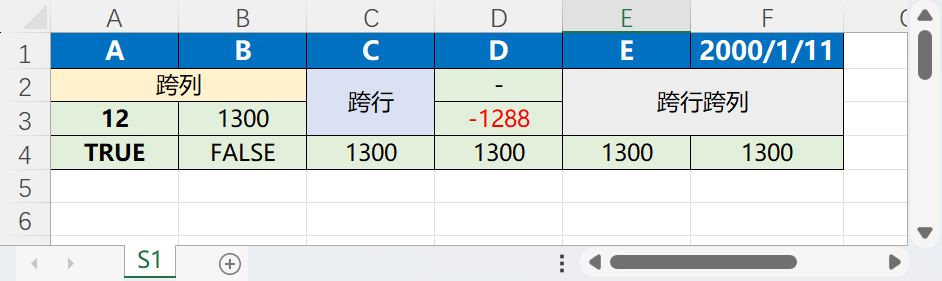
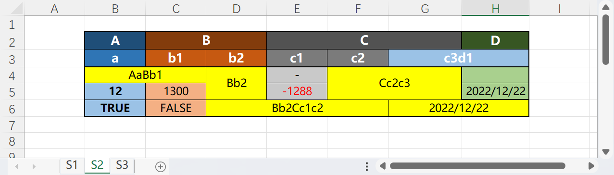
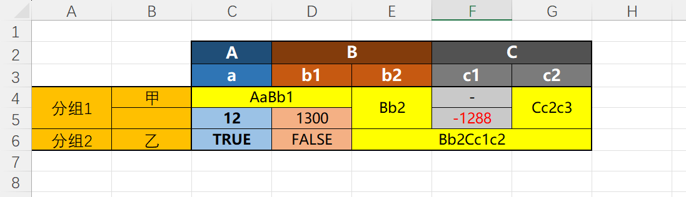

# any2map

`any2map `是一个将可以将数据转为Map的小工具。

目前，此系统包含有以下功能：

- Excel 转 Map
  - 支持多级标题
  - 支持横向分组
  - 获取数据头


## 准备

```xml
<dependency>
    <groupId>com.modern.tools</groupId>
    <artifactId>any2map</artifactId>
    <version>1.0.1</version>
</dependency>
```

## 快速开始

### Excel

使用将`Excel`转为`Map`的时候，使用文件地址作为数据源。

#### 一般将Excel转Map

```java
String filePath = "path/to/your/file.xlsx";
// 创建转换配置
ExcelConvertConfig config = new ExcelConvertConfig(filePath);
// 创建sheet配置
SheetDataConfig sheetDataConfig = new SheetDataConfig();
// 创建日期时间数据配置，坐标(0, 5)表示是日期时间数据
ExcelDateTypeConfig edtc = new ExcelDateTypeConfig(0, 5);
sheetDataConfig.addExcelDateTypeConfig(edtc);
config.addSheetDataConfig(sheetDataConfig);
// 根据配置创建转换器
MapConverter mc = Any2Map.createMapConverter(config2);
DataMapWrapper dmw = mc.toMapData();
// 数据头
MapHeaders headers = dmw.getHeaders();
// 输出结果
Map<String, Object> map = dmw.getData();
```

如下Excel：



数据头：

```json
[
    {
        "name": "A",
        "parentHeader": null,
        "level": 0,
        "leaf": true,
        "keyType": "STRING"
    },
    {
        "name": "B",
        "parentHeader": null,
        "level": 0,
        "leaf": true,
        "keyType": "STRING"
    },
    {
        "name": "C",
        "parentHeader": null,
        "level": 0,
        "leaf": true,
        "keyType": "STRING"
    },
    {
        "name": "D",
        "parentHeader": null,
        "level": 0,
        "leaf": true,
        "keyType": "STRING"
    },
    {
        "name": "E",
        "parentHeader": null,
        "level": 0,
        "leaf": true,
        "keyType": "STRING"
    },
    {
        "name": "2000-01-11",
        "parentHeader": null,
        "level": 0,
        "leaf": true,
        "keyType": "STRING"
    }
]
```

输出结果：

```json
{
  "S1": [
    {
      "A": "跨列",
      "B": "跨列",
      "C": "跨行",
      "D": "-",
      "E": "跨行跨列",
      "2000-01-11": "跨行跨列"
    },
    {
      "A": 12.0,
      "B": 1300.0,
      "C": "跨行",
      "D": -1288.0,
      "E": "跨行跨列",
      "2000-01-11": "跨行跨列"
    },
    {
      "A": true,
      "B": false,
      "C": 1300.0,
      "D": 1300.0,
      "E": 1300.0,
      "2000-01-11": 1300.0
    }
  ]
}
```


#### 将多级Head的Excel转Map

```java
String filePath = "path/to/your/file.xlsx";
// 创建转换配置
ExcelConvertConfig config = new ExcelConvertConfig(filePath);

// 指定数据范围，标题行是[1, 3)，数据行从3开始，数据列从1开始
SheetDataRangeConfig.SheetDataRangeBuilder builder = new SheetDataRangeConfig.SheetDataRangeBuilder();
builder.headRowStart(1).headRowEnd(3).dataRowStart(3).dataColumnStart(1);
SheetDataRangeConfig sheetDataRange = builder.build();

// sheet下标为1
SheetDataConfig sheetDataConfig = new SheetDataConfig(1, sheetDataRange);

// 指定多个时间坐标和格式化
ExcelDateTypeConfig edtc = new ExcelDateTypeConfig(
        new int[][]{{4,7}, {5,6}, {5,7}}, "yyyy-MM-dd HH:mm:ss");
sheetDataConfig.addExcelDateTypeConfig(edtc);
config.addSheetDataConfig(sheetDataConfig);
// 根据配置创建转换器
MapConverter mc = Any2Map.createMapConverter(config);
DataMapWrapper dmw = mc.toMapData();
// 数据头
MapHeaders headers = dmw.getHeaders();
// 输出结果
Map<String, Object> map = dmw.getData();

```

如下Excel：



数据头

```json
[
    {
        "name": "A",
        "parentHeader": null,
        "level": 0,
        "leaf": false,
        "keyType": null
    },
    {
        "name": "a",
        "parentHeader":
        {
            "name": "A",
            "parentHeader": null,
            "level": 0,
            "leaf": false,
            "keyType": null
        },
        "level": 1,
        "leaf": true,
        "keyType": "STRING"
    },
    {
        "name": "B",
        "parentHeader": null,
        "level": 0,
        "leaf": false,
        "keyType": null
    },
    {
        "name": "b1",
        "parentHeader":
        {
            "name": "B",
            "parentHeader": null,
            "level": 0,
            "leaf": false,
            "keyType": null
        },
        "level": 1,
        "leaf": true,
        "keyType": "STRING"
    },
    {
        "name": "b2",
        "parentHeader":
        {
            "name": "B",
            "parentHeader": null,
            "level": 0,
            "leaf": false,
            "keyType": null
        },
        "level": 1,
        "leaf": true,
        "keyType": "STRING"
    },
    {
        "name": "C",
        "parentHeader": null,
        "level": 0,
        "leaf": false,
        "keyType": null
    },
    {
        "name": "c1",
        "parentHeader":
        {
            "name": "C",
            "parentHeader": null,
            "level": 0,
            "leaf": false,
            "keyType": null
        },
        "level": 1,
        "leaf": true,
        "keyType": "STRING"
    },
    {
        "name": "c2",
        "parentHeader":
        {
            "name": "C",
            "parentHeader": null,
            "level": 0,
            "leaf": false,
            "keyType": null
        },
        "level": 1,
        "leaf": true,
        "keyType": "STRING"
    },
    {
        "name": "c3d1",
        "parentHeader":
        {
            "name": "C",
            "parentHeader": null,
            "level": 0,
            "leaf": false,
            "keyType": null
        },
        "level": 1,
        "leaf": true,
        "keyType": "STRING"
    },
    {
        "name": "D",
        "parentHeader": null,
        "level": 0,
        "leaf": false,
        "keyType": null
    },
    {
        "name": "c3d1",
        "parentHeader":
        {
            "name": "D",
            "parentHeader": null,
            "level": 0,
            "leaf": false,
            "keyType": null
        },
        "level": 1,
        "leaf": true,
        "keyType": "DATE"
    }
]
```

输出结果：

```json
{
  "S3": [
    {
      "A": {
        "a": "AaBb1"
      },
      "B": {
        "b1": "AaBb1",
        "b2": "Bb2"
      },
      "C": {
        "c1": 0.0,
        "c2": "Cc2c3",
        "c3d1": "Cc2c3"
      },
      "D": {
        "c3d1": null
      }
    },
    {
      "A": {
        "a": 12.0
      },
      "B": {
        "b1": 1300.0,
        "b2": "Bb2"
      },
      "C": {
        "c1": -1288.0,
        "c2": "Cc2c3",
        "c3d1": "Cc2c3"
      },
      "D": {
        "c3d1": "2022-12-22 00:00:00"
      }
    },
    {
      "A": {
        "a": true
      },
      "B": {
        "b1": false,
        "b2": "Bb2Cc1c2"
      },
      "C": {
        "c1": "Bb2Cc1c2",
        "c2": "Bb2Cc1c2",
        "c3d1": "2022-12-22 00:00:00"
      },
      "D": {
        "c3d1": "2022-12-22 00:00:00"
      }
    }
  ]
}
```

#### Excel转Map再进行分组

```java
String filePath = "path/to/your/file.xlsx";
// 创建转换配置
ExcelConvertConfig config = new ExcelConvertConfig(filePath);

// 指定数据范围，标题行是[1, 3)，数据行从3开始，分组信息范围是[0, 2), 数据列从2开始
SheetDataRangeConfig.SheetDataRangeBuilder builder = new SheetDataRangeConfig.SheetDataRangeBuilder();
builder.headRowStart(1).headRowEnd(3)
        .groupColumnStart(0).groupColumnEnd(2)
        .dataRowStart(3).dataColumnStart(2);
SheetDataRangeConfig sheetDataRange = builder.build();

// sheet下标为3
SheetDataConfig sheetDataConfig = new SheetDataConfig(3, sheetDataRange);
config.addSheetDataConfig(sheetDataConfig);

// 根据配置创建转换器
MapConverter mc = Any2Map.createMapConverter(config);
// 输出结果
Map<String, Object> map = mc.toMap();
```

如下Excel：



数据头：

```json
[
    {
        "name": "A",
        "parentHeader": null,
        "level": 0,
        "leaf": false,
        "keyType": null
    },
    {
        "name": "a",
        "parentHeader":
        {
            "name": "A",
            "parentHeader": null,
            "level": 0,
            "leaf": false,
            "keyType": null
        },
        "level": 1,
        "leaf": true,
        "keyType": "STRING"
    },
    {
        "name": "B",
        "parentHeader": null,
        "level": 0,
        "leaf": false,
        "keyType": null
    },
    {
        "name": "b1",
        "parentHeader":
        {
            "name": "B",
            "parentHeader": null,
            "level": 0,
            "leaf": false,
            "keyType": null
        },
        "level": 1,
        "leaf": true,
        "keyType": "STRING"
    },
    {
        "name": "b2",
        "parentHeader":
        {
            "name": "B",
            "parentHeader": null,
            "level": 0,
            "leaf": false,
            "keyType": null
        },
        "level": 1,
        "leaf": true,
        "keyType": "STRING"
    },
    {
        "name": "C",
        "parentHeader": null,
        "level": 0,
        "leaf": false,
        "keyType": null
    },
    {
        "name": "c1",
        "parentHeader":
        {
            "name": "C",
            "parentHeader": null,
            "level": 0,
            "leaf": false,
            "keyType": null
        },
        "level": 1,
        "leaf": true,
        "keyType": "STRING"
    },
    {
        "name": "c2",
        "parentHeader":
        {
            "name": "C",
            "parentHeader": null,
            "level": 0,
            "leaf": false,
            "keyType": null
        },
        "level": 1,
        "leaf": true,
        "keyType": "STRING"
    }
]
```

输出结果：

```json
{
    "S4":
    {
        "分组1":
        {
            "甲":
            {
                "A":
                {
                    "a": "AaBb1"
                },
                "B":
                {
                    "b1": "AaBb1",
                    "b2": "Bb2"
                },
                "C":
                {
                    "c1": 0.0,
                    "c2": "Cc2c3"
                }
            },
            "4":
            {
                "A":
                {
                    "a": 12.0
                },
                "B":
                {
                    "b1": 1300.0,
                    "b2": "Bb2"
                },
                "C":
                {
                    "c1": -1288.0,
                    "c2": "Cc2c3"
                }
            }
        },
        "分组2":
        {
            "乙":
            {
                "A":
                {
                    "a": true
                },
                "B":
                {
                    "b1": false,
                    "b2": "Bb2Cc1c2"
                },
                "C":
                {
                    "c1": "Bb2Cc1c2",
                    "c2": "Bb2Cc1c2"
                }
            }
        }
    }
}
```


### To Do List

- 测试事件读取 hssf 和 xssf 的效率，确定最大读取大小。优化60M+文件读取
- Mongo 数据转Map实现
- Jdbc 数据转Map实现
- xls 事件读取公式问题


